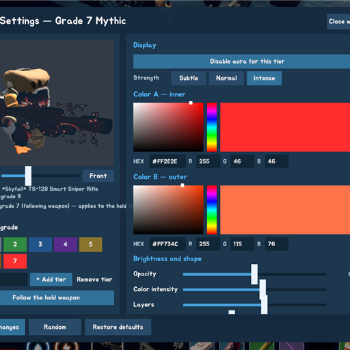

# Weapon Aura

**English** · [한국어](README.ko.md) · [简体中文](README.zh.md)

An aura that spreads outward from your weapon's surface in **Escape from Duckov**, colored by the weapon's grade. Not a cloud of particles — a shell that follows the weapon's own silhouette.

[](https://steamcommunity.com/sharedfiles/filedetails/?id=3784602736)
[](LICENSE)



---

## Features

**Grade-based auras** — Seven tiers ship by default, one per item grade 1–7. Special and crafted grades such as 9 or 999 can be added yourself and styled separately.

**In-game settings window** — Opens from the `Aura Settings` button in the pause menu. Built from the game's own font and colors, and grafted onto the game's panel stack so `ESC` closes it the way any other panel closes.

**Live 3D preview** — Shows the weapon you are actually holding, on an isolated stage that holds nothing but a copy of your character and weapon. Pick a grade and its color appears instantly; drag to spin, or zoom.

**Color picker** — Grab a color from the saturation/value square and hue bar, or type an exact value as HEX (`#FF8800`) or R/G/B.

**12 elemental templates** — Aurora / Fire / Frost / Toxic / Void / Shock / Holy / Blood / Arcane / Plasma / Nature / Shadow. One click swaps the whole look and motion.

**Particles and trails** — Tune the rate, size and life of the surface particles, and switch on trailing tails.

**Per-grade on/off** — Silence a whole grade when you don't want an aura on low-grade weapons.

## How it works

The visible effect is a **silhouette shell**: the weapon's own mesh is drawn a second time, inflated
along its normals, one copy per layer. That is what makes the aura take the shape of the gun instead
of sitting around it as a blob.

Three things about this game made that harder than it sounds, and each shaped the implementation:

| Problem | What the code does |
|---|---|
| Weapon meshes have `isReadable = false`, so vertices cannot be read on the CPU | The shell references `MeshFilter.sharedMesh` and only scales it — rendering never needed CPU access |
| URP particle shaders multiply by vertex color, so the shell vanished on weapons with dark vertex colors | The shell uses `Universal Render Pipeline/Unlit` with premultiplied alpha and `One/One` additive blending |
| `CharacterModel.AddSubVisuals` hands mesh renderers to `hurtVisual`, which overwrites their MaterialPropertyBlock | `CharacterSubVisuals` registration happens *before* the shells are created, so they are never handed over |

Weapon grade comes from `ItemAssetsCollection.GetMetaData(TypeID).quality`. `Item.DisplayQuality`
reads 0 for every weapon in this game and is not usable for tiering.

Renderer selection deliberately excludes `LineRenderer`, socket children and attachments that carry
their own `ItemAgent` — a laser sight's `LineRenderer` inflated the weapon bounds to 13–30 m and
produced a screen-filling blob.

## Installation

**Steam Workshop (recommended)** — Subscribe on the [Workshop page](https://steamcommunity.com/sharedfiles/filedetails/?id=3784602736).

**Manual** — Copy the built mod folder into:

```
<Escape from Duckov>/Duckov_Data/Mods/WeaponAura/
```

Harmony ships with the mod (`0Harmony.dll`), so no separate Harmony mod is required.

## Usage

1. Press `ESC` in game to open the pause menu.
2. Click `Aura Settings`.
3. Pick a grade, adjust the color and shape, then press `Save changes`.

Saved settings load automatically next time, and `Restore defaults` puts everything back. Aiming and
firing are blocked while the window is open, and `ESC` closes just the window.

Settings are written to `weapon_aura_tuning.json` next to the mod.

## Building from source

Requirements:

- [.NET SDK](https://dotnet.microsoft.com/download) — built and tested with 10.0.x
- Escape from Duckov installed (the build references the game's assemblies through the Ducky SDK)

```bash
git clone https://github.com/ing-gom/duckov-weapon-aura.git
cd duckov-weapon-aura
dotnet build -c Release
```

If the game is not installed in the default Steam location, copy `Local.props.example` to
`Local.props` and set your path:

```xml
<Project>
  <PropertyGroup>
    <DuckovFolder>D:\Games\Escape from Duckov\</DuckovFolder>
  </PropertyGroup>
</Project>
```

`Local.props` is git-ignored, so your local path never gets committed.

A diagnostic IMGUI panel is compiled into **Debug builds only** (`F8`). It exposes every raw value,
custom particle textures from `assets/vfx_textures/`, and weapon mesh export to OBJ. Release builds
ship only the settings window.

## Project structure

| Path | Contents |
|---|---|
| `ModBehaviour.cs` | Mod entry point and lifecycle |
| `Systems/WeaponAuraSystem.cs` | Polls the held weapon, resolves its grade to a tier, builds and tears down the aura |
| `Systems/WeaponAuraController.cs` | One aura instance — surface particles, orbiting rings, shells, material factory |
| `Systems/WeaponAuraSheet.cs` | A single shell layer: silhouette cloning, per-axis growth, concentric wave colors |
| `Systems/WeaponAuraProfile.cs` | Tier profiles, 12 elemental presets, seeded random, JSON save/load |
| `UI/WeaponAuraWindowCanvas*.cs` | The in-game settings window (partial class: root, layout, widgets) |
| `UI/WeaponAuraPreviewStage.cs` | Isolated preview stage and its camera |
| `UI/ColorPickerControl.cs` | Saturation/value square, hue bar, HEX and R/G/B fields |
| `UI/PauseMenuButton.cs` | Injects the `Aura Settings` button into the pause menu |
| `Patches/` | Harmony patches that block aim and fire while the window is open |
| `assets/` | `info.ini`, locales, Workshop title and descriptions, thumbnail |

## Reporting bugs

Please open an [issue](https://github.com/ing-gom/duckov-weapon-aura/issues) with:

- `Player.log` (or its last 200–300 lines)
- The weapon you were holding and its grade
- The list of other mods you have enabled
- Steps to reproduce

Log file locations:

```
Windows   %USERPROFILE%\AppData\LocalLow\TeamSoda\Duckov\Player.log
macOS     ~/Library/Logs/TeamSoda/Duckov/Player.log
```

`Player-prev.log` in the same folder holds the previous session.

## Credits

Code and images were produced with AI assistance.

## License

[MIT](LICENSE) for the source code in this repository. Third-party code keeps its own license — see
[NOTICE.md](NOTICE.md).

## Disclaimer

This is an unofficial fan modification. *Escape from Duckov* and all related assets are the property
of **TeamSoda**. This project is not affiliated with, endorsed by or sponsored by TeamSoda, and ships
no game assets or decompiled game code.

## Author

inggom — an Escape from Duckov mod, sibling to [Gun Master](https://github.com/ing-gom/duckov-gun-master)
and the [sts2-*](https://github.com/ing-gom?tab=repositories) Slay the Spire 2 mods.
